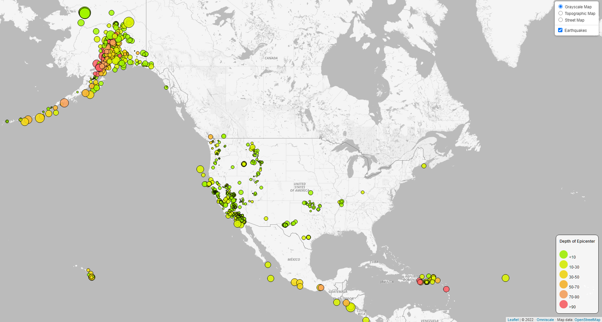
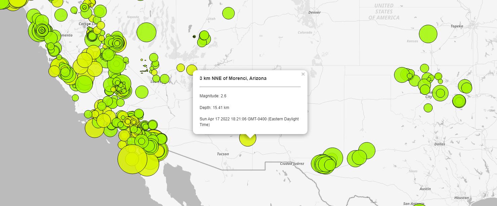

# Leaflet-Challenge

## Gathering the data

This project takes a look at earthquake data provided by the [USGS GeoJSON Feed](https://earthquake.usgs.gov/earthquakes/feed/v1.0/geojson.php), which is an API that provides the most recent earthquake based on various timeframes and is updated every minute. For this project, I obtained the GeoJSON information for [all earthquakes for the past 7 days](https://earthquake.usgs.gov/earthquakes/feed/v1.0/summary/all_week.geojson)  (as of 2022/04/21).

Because the information is contained in a *Geo*JSON formatted file, the data we will want to target is the data value contained under the **features** key.

## Visualization

Using the information contained in the features, I pulled out the **depth**, **magnitude**, *time** and **place** information to display onto the tooltip for each marker drawn on the map. To scale the area of the circles, I used a quick math function that took the magnitude of the recorded earthquake and multiplied that value by a factor of 20000 (the large factor is due to the fact that I was using a high-resolution [grayscale map layer provided by Omniscale](https://maps.omniscale.com/en/examples/leaflet_grayscale)). The color is coded based on the value of each earthquake's depth. The time and place of the earthquake was used to add additional information to the tooltip, as shown below.

## Configuring the map layer

As mentioned earlier, the grayscale map was provided by a third-party host. To configure the map, I needed to obtain an API key in order to properly configure the map. The API key used in the `logic.js` file is the public key that maps to my own private API key that I have with the service. This key will expire on **May 6th, 2022**, so if by chance you are reading this README and it is past that date, there is a good chance the map would have expired by then.